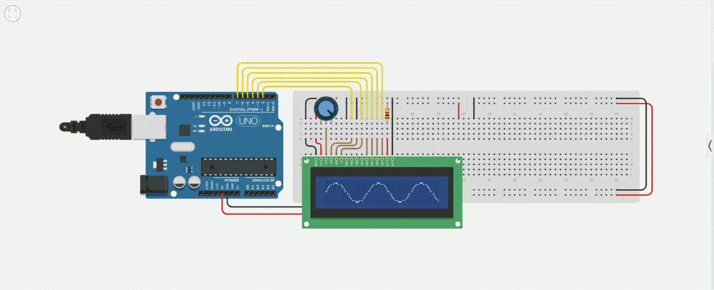

# Sine Wave Animation on a LCD1602
Animate A sine Wave on an LCD Display

### Requirements

To run this project, you will need the following:

- **Microcontroller**: An Arduino or compatible microcontroller.
- **LCD Display**: LCD1602 module
- **Libraries**:
    - `LiquidCrystal_I2C` library for controlling the LCD.
- **Software**: Arduino IDE or PlatformIO for compilation

Ensure all components are properly connected and the required libraries are installed in the Arduino IDE.

### Pin Mapping

| **LCD Pin** | **Microcontroller Pin** | **Description**       |
|-------------|-------------------------|-----------------------|
| RS          | 2                       | Register Select       |
| Enable      | 3                       | Enable Signal         |
| D4          | 4                       | Data Line 4           |
| D5          | 5                       | Data Line 5           |
| D6          | 6                       | Data Line 6           |
| D7          | 7                       | Data Line 7           |

Ensure the connections are made as per the table above or adjust it in code.

